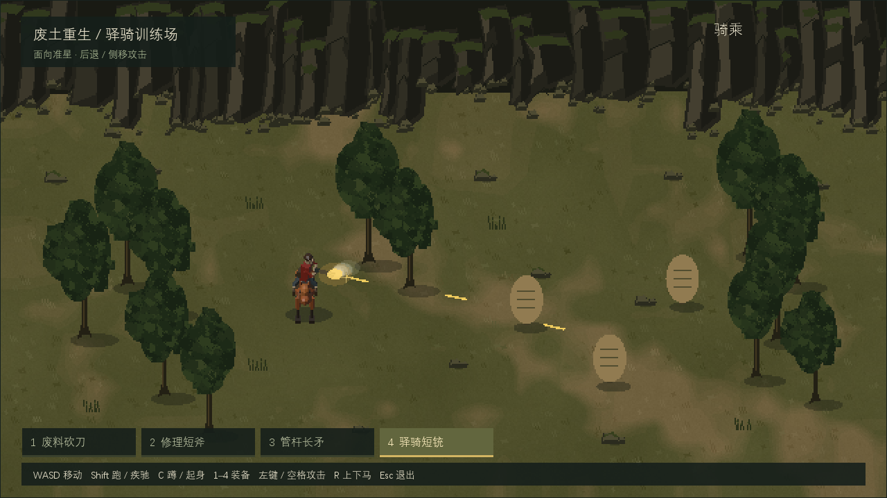
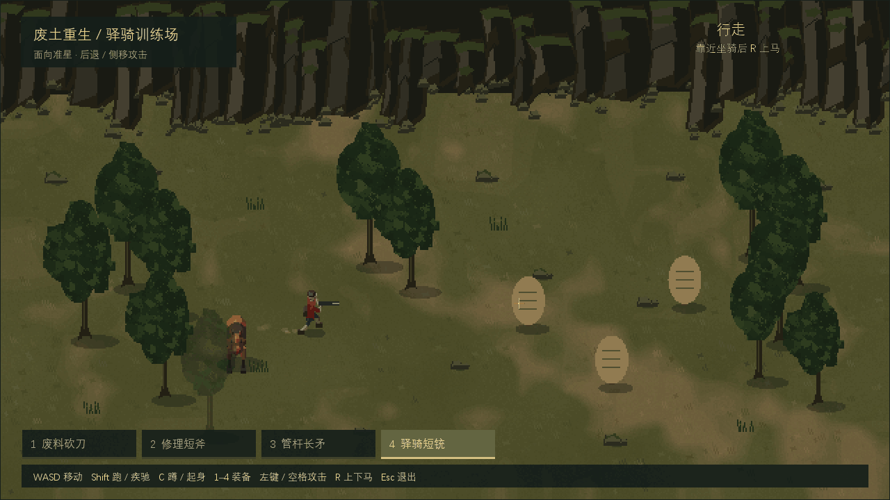

# 废土重生像素伪3D制作参考

本仓库仅用于 GitHub Pages 展示制作参考文档与精选媒体，不包含可运行游戏、完整游戏源码、原始图集或 Blender 母版。在线入口为 [index.html](index.html)，离线阅读可[下载分享包](downloads/style-reference.zip)。本网站是风格制作参考，不是可玩游戏。

这套参考记录《废土重生》当前小样的场景、人物、坐骑、装备和动画制作方法，以及已经遇到的问题与修复方式。适合希望制作同类斜俯视横屏游戏的美术、动画和程序人员。

解压后双击 `index.html` 即可离线阅读和播放 GIF，无须安装 Maker、Blender 或文档插件。发送给别人时请发送整个压缩包，保留 `media` 文件夹。四篇 Markdown 是可编辑的文字原稿。

## 网站自定义

标题、简介、配色、字体、目录、媒体、下载及域名的实际修改位置，请看[网站自定义说明](网站自定义说明.md)。默认发布仓库为 `975269528/wasteland-pixel-style-guide`，预期[在线阅读地址](https://975269528.github.io/wasteland-pixel-style-guide/)以实际部署结果为准。

## 阅读顺序

1. [风格规范](style-guide.md)：场景与对象的形体、色彩、像素密度和动画表现。
2. [实现流程](implementation.md)：从离线三维母版到运行时二维图集，及移动、持械、骑乘契约。
3. [问题与解决方案](troubleshooting.md)：症状、原因、正确修复和验收方式。
4. [复用检查清单](reuse-checklist.md)：把方法迁移到其他项目时先统一哪些约定。

## 当前效果





预览由当前 Runtime 的真实 GPU 截图组成，没有补帧或生成动作。片段之间省略等待时间，片段内按采集时序播放。GIF 最多保留 256 色，判断刃与材质颜色时优先看 PNG。

## 版本和验证范围

制作参考日期为 2026 年 10 月 9 日，对应游戏代码 `adbd259`。当前普通行走和跑步播放率分别为 16.2 和 21.6 帧每秒；水平普通移动约 143.88 和 235.61 逻辑像素每秒，比上一版同步降低 10%。战斗移动保持原节奏。

在 Windows 官方 Runtime `20260923-1717-bf3316f` 中完成 31 组行为检查，并检查真实 GPU 走跑、后退、侧移、骑射和三种骑乘近战画面。手机触控、性能、显存和不同屏幕仍需真机验收。

分享包用于学习风格与实现方法，包含文档和精选效果预览；完整游戏源码、原始图集与 Blender 母版保留在项目中。源码入口为 `research/pseudo3d-prototype/README.md`，资产重建入口为 `research/pseudo3d-prototype/assets/source/README.md`。只拿到这个分享包的读者可以按流程重做自己的资产，不能直接运行该游戏小样。

这里的预览来自本项目制作资产，不包含最初参考视频、参考视频截图或第三方模型。

## 维护方法

改变相机、比例、图集布局、方向编号或动画节奏时，应同时更新风格规范、元数据契约和效果预览。先确认运行时行为与画面，再更新文档中的参数与版本，避免拿旧 GIF 证明新代码。

文档网页由 `build-document.mjs` 生成。维护者需要 Node.js 和 `marked`，可在自己的工具目录安装 `marked` 后，将其入口作为参数传入：

```powershell
node build-document.mjs "path/to/marked/lib/marked.esm.js"
```

生成后的 `index.html` 与 `reader.css` 均为本地文件，阅读者不需要这些构建工具。
