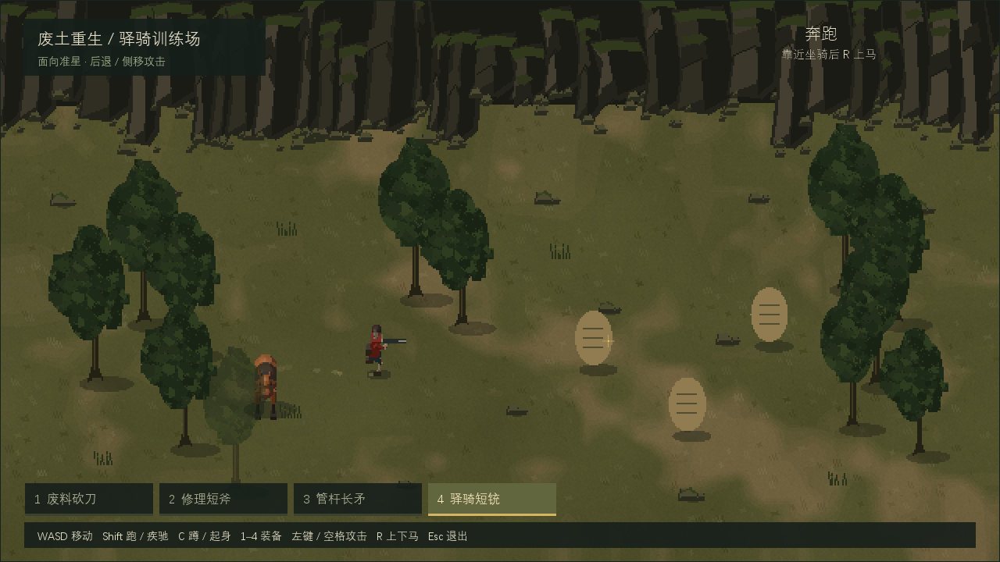
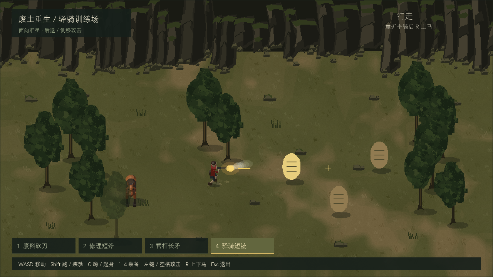
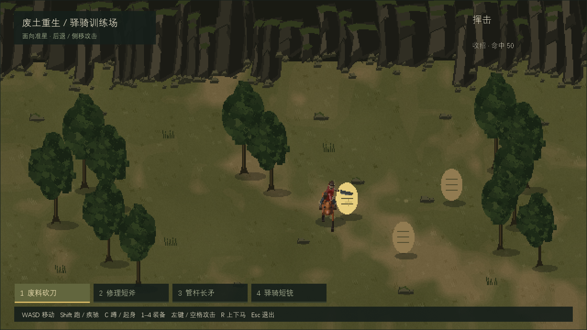

# 废土重生画面与动画制作规范

本规范描述《废土重生》当前视觉小样，可用于沟通风格、制作新素材及审阅效果。它提炼参考画面的视角、形体和配色规律，素材由本项目原创制作；不包含原始参考视频，也不据画面断言参考作品使用了哪种引擎。

配套阅读：[实现说明](implementation.md) · [问题与解决方案](troubleshooting.md) · [复用检查表](reuse-checklist.md)

本分享包只包含文档与精选媒体。文中的 `research/pseudo3d-prototype/...` 是完整项目内的定位信息，不代表包中附带源码、资产全集或可运行游戏。

## 1. 风格定义与制作方式

整体是固定斜俯视下的废土驿骑：暗橄榄草土、深绿长冠树群、暗褐棱角岩壁，红衣人物与橙褐马作为视觉中心。环境低对比，角色轮廓和装备动作优先可读。

人物、马和装备采用原创低模3D母版，在离线制作时按方向和姿态渲染成透明PNG；运行时只显示2D精灵及图层。地面、树和岩壁是程序化绘制的像素图，用面块、裂隙和明暗组织表现体积。它们都不是本小样运行时的实时3D模型。

“伪3D/2.5D”在这里指固定投影、二维平面移动、体积感精灵与前后遮挡的组合。角色可以自由前后左右移动；不是侧视平台玩法，也不能靠左右镜像代替完整多方向体积。

图中沙袋、准星和装备条是功能验证道具；正式关卡可替换，但应保留人物与环境的明度层次。

## 2. 镜头、像素与光照

| 项目 | 当前制作标准 | 更换时的要求 |
| --- | --- | --- |
| 投影 | 固定45度俯角、正交投影 | 改俯角或透视时重烘整组，不能倾斜单张精灵补偿 |
| 离线相机 | 母体相机 `(0,-8,8)`、正交范围4.6 | 同组人物、马、装备保持一致 |
| 母体坐标 | 地面X/Y、竖直Z；默认正面朝−Y | 和运行时屏幕坐标分开处理 |
| 世界缓冲 | 640×360，关闭边缘抗锯齿 | 地形、精灵和世界特效共用像素网格 |
| 标准窗口 | 1280×720、最近邻整数2倍显示 | 每个世界像素为2×2屏幕像素 |
| HUD | 窗口分辨率单独呈现 | 文字与准星保持清晰，不跟世界一起降采样 |
| 原生角色帧 | 128×128、RGBA、关闭渲染抗锯齿 | 透明边缘不带灰边，不能先渲染模糊图再仅开nearest |
| 离线照明 | Workbench材质色、统一Studio光、Standard变换 | 不逐方向改变灯光，不把烘焙阴影重复画到地面 |

1024×768窗口采用等比例留边，内容为1024×576。此时非整数放大会分配交替的1/2屏幕像素；锐利边缘仍应保留，但不称为严格2×2。

颜色必须检查最终GPU截图。末级采样和颜色转换不正确时，即使原生PNG很清晰，也会出现软边、泛灰或整体变亮。先修呈现链，再改美术；不可把加深贴图当作错误Gamma链的补偿。

## 3. 环境的形体与色彩

### 草土与裸地

地面由多尺度暗斑、有限色阶裸土、局部碎土和短草簇组成。裸地沿活动区域形成较窄、断续的土褐斑块，草土边缘交错；避免清晰圆帽、连续圆弧和均匀宽路带。

大面积地色变化可以柔和，但局部必须有可辨认的断边和2–5原生像素小簇。细颗粒低对比、疏密不一，不铺满等密度噪点，也不让地面变成模糊云纹。

### 树

树干细长，露出一段明确的干身，根部稍向外扩。树冠由数团纵向叶块互相咬合，外轮廓与下缘不规则；深色缝隙比大片亮面更重要。避免单个均匀球冠、粗圆柱树干和整排完全相同的树。

至少保留两种轮廓变体，配合少量尺度差异及树群重叠。较密树群放在场景边缘或局部区域，主要活动区留出角色和目标的可读空间。

当前遮挡方案是整棵树淡出至0.52，而不是树冠单独淡出或穿墙轮廓。树仍按脚点排序；需要轮廓透视效果时应另行验证平台与shader支持。

### 岩壁与碎石

岩壁要读成连续高墙：几组高低、宽度、进退和斜面不同的大块岩体，用深竖裂连接；顶部只有少量苔草，底部碎块与地面衔接。避免等高等宽的竖栏，也避免苔藓亮顶盖住岩面，使石墙读成草台。

当前岩壁是固定后景叠层，实体底缘为逻辑y202，角色最小活动脚点y220。它不是可以穿过、绕到背面或自动参与人物遮挡的前景实体。

小碎石和草簇采用稀疏点簇补充空间层次。石块有独立小阴影，草不画同样大小的黑椭圆。主体PNG不烘焙地面投影，避免双影。

| 部位 | 当前源图RGB参考 | 使用原则 |
| --- | --- | --- |
| 草土地色 | `(79,79,43)` | 暗橄榄，允许克制的局部明暗变化 |
| 裸土 | `(111,96,62)` | 土褐，与草地软交错而不发亮 |
| 树叶块 | `(24,35,20)` 至 `(54,65,35)` | 多暗缝、少量受光小面 |
| 岩面 | `(27,27,21)` 至 `(68,63,48)` | 深裂隙、大面块、有限亮面 |
| 人与马 | 红衣、深灰裤、橙褐马、深鬃尾 | 比背景更明确，不给环境同强度高饱和亮色 |

表中环境数值是PNG源色与范围，不是每处GPU像素必须等于它们；人物与马的材质色还会经过离线照明。

## 4. 人物、马与装备

人物比例和部件以小尺寸轮廓为准：头胸、裤腰、两腿和持握手必须分得开，不靠大量细纹理救轮廓。马有明确胸腹、长颈、近远侧腿和鬃尾；八方向必须呈现不同遮挡关系。

鞍垫贴合马背，座面边沿薄。裸马、骑乘、站骑和疾驰之间应保持同一鞍轮廓，避免下马后突然出现竖方箱。

三种近战装备应有不同剪影：砍刀有暗直背、亮凸长刃和弯尖；短斧有短柄、斧板和明确单刃外缘；管杆长矛有长杆与独立尖端。武器从真实手腕/握点生成，不能在屏幕上悬浮旋转。

砍刀与斧的板面属于真实挥击平面，切刃领先前下挥击。数学向量正确仍不足：在实际GPU尺寸下，刀背不能比磨刃更像锋刃；必须看前摇、接触和随挥连续帧，确认真正长刃入目标，而不只看刀尖或任意头部碰袋。

## 5. 动作规范

| 动作 | 形体与行为 | 当前节奏 |
| --- | --- | --- |
| 普通走路 | 低摆脚、较直支撑腿、小髋高变化 | 六关键帧、16.2帧/秒；横向约143.88逻辑像素/秒 |
| 普通跑步 | 较大步幅、明显屈膝回摆，比走路更有力度 | 六关键帧、21.6帧/秒；横向约235.61逻辑像素/秒 |
| 自然站立 | 独立并脚站姿，不冻结最大跨步帧 | 普通腿图集列6，仅idle使用 |
| 战斗走/跑 | 面向目标，腿按相对移动方向前进、后退或侧步 | 保持14/16帧/秒及原战斗步幅速度 |
| 蹲伏与蹲移 | 真屈髋屈膝、低重心；两脚小幅换相 | 两关键帧、6帧/秒，骑乘拒绝蹲伏 |
| 近战 | 蓄力→接触→回收，整招锁攻击方向，脚点仍可移动 | 六姿态，接触姿态索引2 |
| 马走与疾驰 | 走为较稳节奏，疾驰有收腿、伸展、落蹄、推蹬与腾空分相 | 骑手贴鞍并共享座位起伏 |
| 骑乘近战 | 座高专用上身，刀斧下劈、长矛下刺 | 马继续按输入移动，身体转幅受限 |

普通walk最高摆脚约0.027m、支撑膝内角约142–158度；run最高摆脚约0.162m、回摆膝可弯至约90度。这些是当前母版检查值，不是换身材后机械照抄的目标。

两张GPU静帧用于看姿态与场景比例；是否自然、足底是否漂移，要看同一动作的真实连续帧。

普通步态和战斗步态分开。普通face等于move；战斗face与move可以不同，但上下身仍同朝face，脚在face坐标系中按相对方向移动。不能把下身转到move而上身留在face，拼出180度腰扭，也不能倒播整身帧假装后退。

触地段脚端点应单调等距回扫，回摆段再抬脚。移动速度按真实触地跨度、帧率和地面投影换算；只增加角色位移、不匹配腿周期会滑步。普通走跑降速或提速时，应同时调整周期速率，战斗移动保持独立配置。

上身攻击不重置下身节拍；持续按住攻击、收招和冷却空档仍保持面向目标。站/蹲、上下马和换装有明确互斥规则，不用图像拉伸补动作缺口。

画面中的上身和持枪方向保持朝向目标；腿向后退，不把整人倒转。侧移同样保留人物身体朝向，只改变局部步轨迹。

## 6. 自然关节、握持与骑乘限制

当前人物上臂/前臂长0.30/0.29m，大腿/小腿长0.355/0.350m。肘膝内角限制25–170度，肩抬举限制170度。先约束真正手/脚端点，再生成关节和装备，不能只夹IK求解距离却仍画未限制的远端。

枪主掌与同轴支撑掌相距0.12m，矛双握距0.16m；两掌可达性校正时整组平移，保持轴与握距。刀斧至少主掌始终闭合在柄上。所有八方向、所有姿态都要检查实际骨段长度和角度极值，并实际查看最极端姿态。

骑乘身体相对马最多左右各90度，超范围不能扭到身后。骑近战开招锁face；马急转使身体越界时取消该招并保留冷却。马下身按移动方向，骑手上身按合法攻击方向，座位起伏同时作用于上身、枪掌及切刃点。

骑枪上身采用16个真实22.5度方向，马与驻马仍是八方向。枪管相对所选真实持握方向的余角限制24度；用真实主掌和当前座位偏移扫描合法姿态，避免用肩中心选方向造成近距接缝拒射。真正不可达的身后目标仍提示调整朝向。

骑乘近战必须用座高专用腕点与武器轴，使刀刃、斧刃或矛尖落入实际目标轮廓。只提高日志命中范围、取消骑乘拒绝或把整张站姿抬高，不算适配完成。

## 7. 制作与验收顺序

1. 先锁相机、角色尺寸、足点、图集方向、共同髋接点和色彩呈现；与接入者书面确定metadata。
2. 先做E/W侧面和S/N极值方向的少量原生帧，查看轮廓、腰缝、刃背、双掌与近远腿，不先盲烘全集。
3. 对源几何测真实骨长、角度、握距、脚触地点与切刃位置；同时看最极端实际姿态。
4. 样帧通过后只重烘涉及的资产组，打包、透明边界和裁切检查，并同步manifest、metadata与复建说明。
5. 在真实运行时检查标准窗口、前后遮挡、普通/战斗切换、后退侧移、骑乘起伏、近角射击和目标接触。
6. 用GPU连续帧展示真实动作；CPU状态标签可能比画面早，不以标签单独认定精确接触相位。确认画面、反馈和行为测试后再冻结交付。

## 8. 适用范围

当前已验证的是桌面官方Runtime中的视觉与交互小样。分享包中的图片是实际GPU截图；原生审阅页只能证明素材形体，不能替代运行效果。

预览为当前版本的213张真实GPU帧，1280×720、10.79秒，包含普通走跑、战斗移动、骑枪及三种骑近战。保留段内实际时间，移除采样窗口之间的长空档，不插帧。GIF仅256色；材质色与细边缘以本包PNG为准。

手机显存、发热、触控、真机横屏、目标平台shader与低端设备性能仍未实测。环境是固定整场图与后景边界，不是大型地图、可破坏山体或完整寻路系统。扩大世界或更换引擎时，请按[复用检查表](reuse-checklist.md)重新验证。
